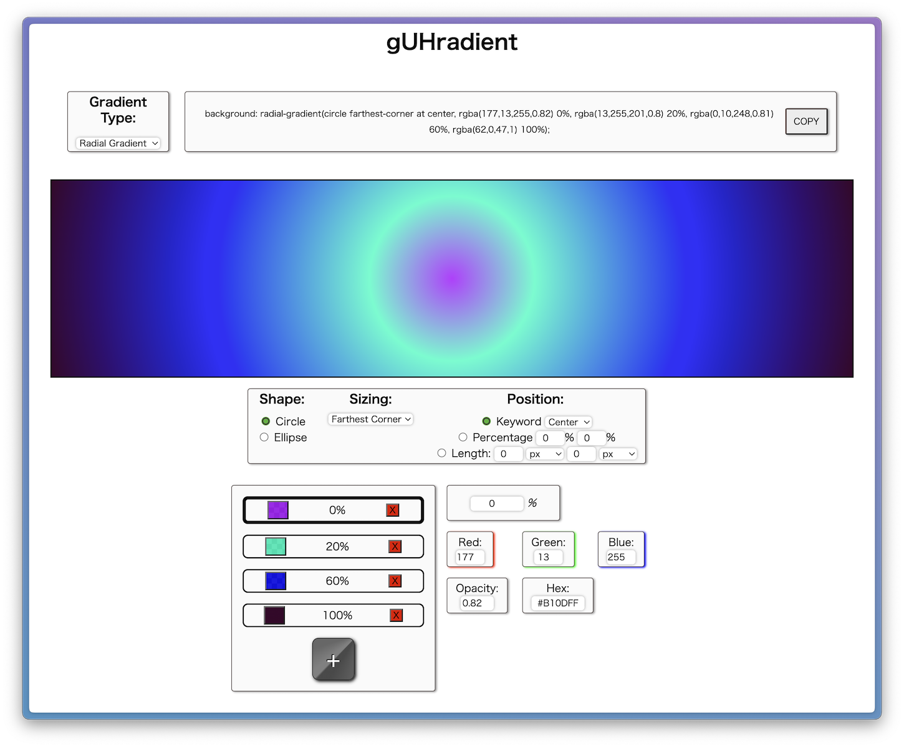

# CSS Gradient Playground

This is just a simple tool I use for playing with gradients. Still a work in progress.

## Installation

1. Fork and clone the repository

2. Open index.html

## Contributing

Pull requests are welcome. For major changes, please open an issue first to discuss what you would like to change.

## License

[MIT](https://choosealicense.com/licenses/mit/)
